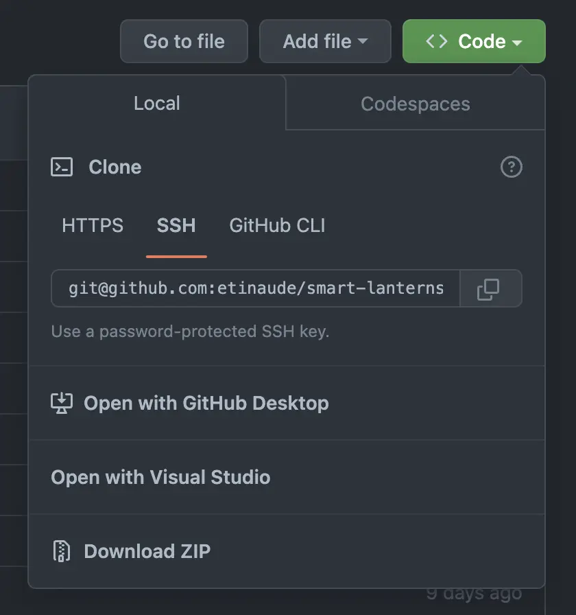
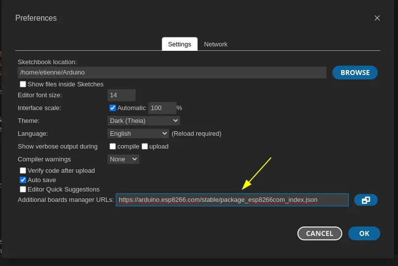
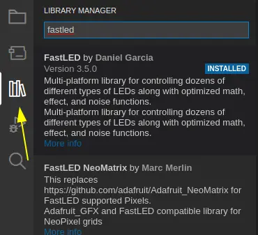
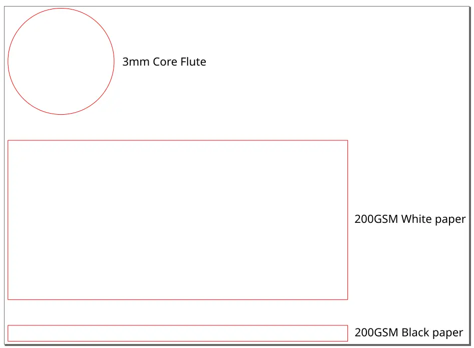
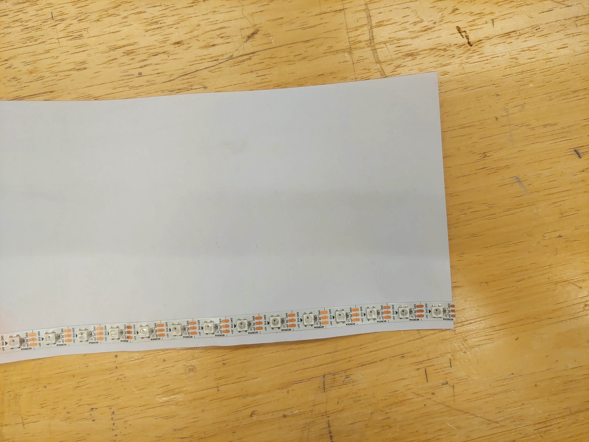
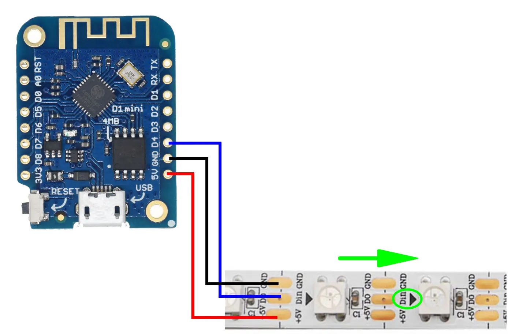
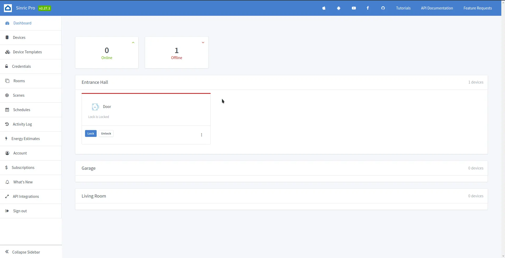
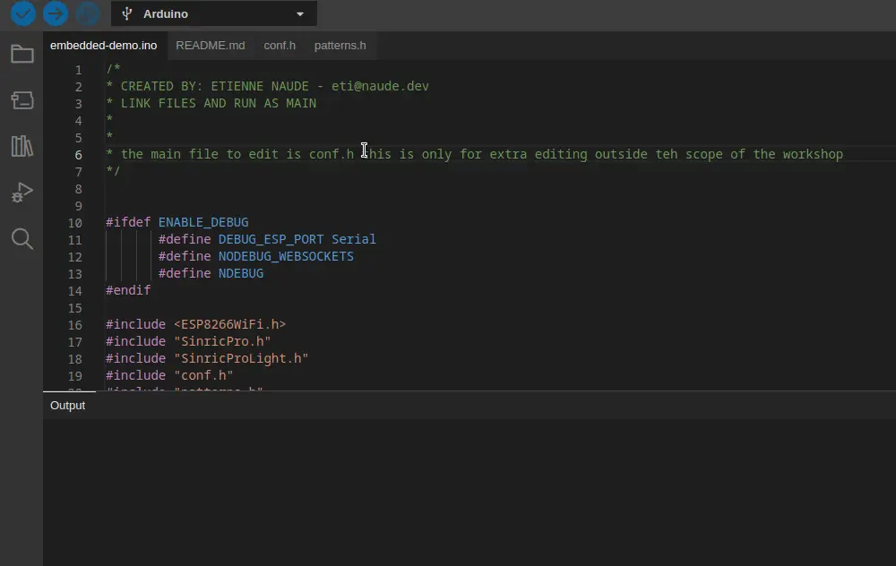

# Smart Lanterns

## Presented by GSDC and Maker Club UoA

## `Introduction`

TIME: ~ 2.5hr

WRITTEN BY: [Etienne Naude](https://etinaude.dev)

LINK: [https://github.com/etinaude/smart-lanterns](https://github.com/etinaude/smart-lanterns)

## `Format of the event`

This is a free event with the goal of sending everyone home with a smart lantern and a new set of skills. The event will be broken down into 5 parts:

**Intro**: We introduce the clubs and demonstrate briefly how to make the lanterns and explain what we will be doing.\
**Collab**: Breaking into teams of 3-5 working together to make one lantern.\
**Individual**: Using the process learned in the previous step to make the rest the new lanterns for the team.\
**Food**: Needed for survival by humans.\
**Outro**: Bring the group back together and going further with the lanterns, as well as exploring more options for this tech.

## `Step 1: Code`

The first step is to download the code for this project which you can do from here:

[https://github.com/etinaude/smart-lanterns](https://github.com/etinaude/smart-lanterns)

click the green code button then select `Download ZIP`

you should find these instructions in the README.md file.

## `Step 2: Get Software`

This project use arduino which requires the arduino IDE to run, I recommend using [Arduino IDE 2.0 RC](https://www.arduino.cc/en/software#future-version-of-the-arduino-ide), but platform IO or Arduino version 1 are also supported.

## `Step 2.1: Board Manager`

Update the board manager:
click `file > preferences > Additional board manager URLs` and paste this link into it `https://arduino.esp8266.com/stable/package_esp8266com_index.json`

then click `OK`.

Once this is done install the new board manager by clicking the board icon searching `esp8266` and clicking `Install`.

## `Step 2.2: Libraries`

Click on the library icon and search for `FastLED`, then click install. Do the same for `sinricPro`.

## `Step 2.3: Open Code`

Open the code in Arduino, all the files are located in the folder named `smart-lanterns`. You can open this by clicking `file > open` in the top left corner.

## `Step 3: Hardware`

During the in person workshop we will provide you with a few components, these are:

- 1 - [Wemos D1 mini ESP8266 dev board](https://www.aliexpress.com/item/1005001621784437.html?spm=a2g0o.order_list.0.0.21ef1802m8rokq) (which will be referred to as an "ESP")
- 0.5m - [60led/m 5050 addressable LEDs](https://www.aliexpress.com/item/1005001345392567.html?spm=a2g0o.order_list.0.0.21ef1802m8rokq)
- 3 - Jumper wires soldered to the LEDs (soldering not covered in the workshop)
- Hot glue
- Masking tape
- [Lasercut corflute](./laser%20cutting.svg)
- [Lasercut 120gsm White Card](./laser%20cutting.svg)
- [Lasercut 120gsm Black Card](./laser%20cutting.svg)

You will need to bring 2 things

- A laptop with an internet connection and USB ports
- A data micro USB cable

### `Step 3.1: Laser cutting (Pre-done)`

Laser cut the paper following the file in the [laser cutting.svg](./laser%20cutting.svg) file, which should look roughly like this (outdated):

### `Step 3.2: Building the lantern`

Place the LED strip about 2-3 mm from the bottom of the card and stick it down using the adhesive tape on the back of the LED strip, using hot glue to secure it if needed. This is shown in the image below:

Next, hot glue the core flute to bottom edge of the card below the LED strip being **CAREFUL to not crease the card**

Lastly, hot glue the black card to the outside of the white card to hide the LED strip when the lights are on.

### `Step 3.3: Wiring`

Wire the LEDS to the D4 of the ESP. Making sure that you wire in the direction of the arrow. This step is shown in the image below.

- +5V -> VIN
- GND -> GND
- DIN -> D4

### `Step 3.4: Securing the ESP`

Once this is done, place the ESP in the hole in the core flute, with the wire traveling to the outside. Once the programing is done, and you are sure everything is working, place the masking tape under the ESP to prevent it falling out.

## `Step 4: Configuration`

### `Step 4.1: WIFI`

We will use [Sinric Pro](https://sinric.pro/index.html) to connect this to the internet and to [Google Assistant](https://assistant.google.com/)

Start by creating a [free Sinric Pro account](https://portal.sinric.pro/register). Although it is possible to sign up using a temporary email, it is not recommended as you might want to log in again later to add new devices or change your configurations.

then create a new light by clicking on devices and **+ Add Device**.

then fill in a name for your circle and select **Smart Light Bulb** for the Device Type.

Then click next until you are on the screen which shows the details of your device. It should look like this:

### `Step 4.2: Configuration File`

Open the demo code in the Arduino IDE (Step 2.3)

copy paste each field into the **config.h** and add your WIFI details (name and password)

### `Step 4.3: Pattern`

In the config file select a pattern by uncommenting (removing the `//`) the pattern you would like. The pattern options are at the end of this document.

## `Step 5: Upload Demo Code`

Plug the ESP into your laptop and\
Select `LOLIN(WEMOS) D1 mini clone` from the drop down menu.\
Then click the upload button (right pointing arrow).\
And wait for your code to compile and upload. As seen in the image below:

## `Step 6: Voice Assistant`

You can add a connection to Google Assistant via the sinric pro app. Download the app from the [Google Play Store](https://play.google.com/store/apps/details?id=pro.sinric&hl=en_NZ&gl=US) or the [Apple App Store](https://apps.apple.com/us/app/sinric-pro/id1513086098). From the app you log in and all your devices should display in a list. Then you can open the [Google Home](https://play.google.com/store/apps/details?id=com.google.android.apps.chromecast.app&hl=en_NZ&gl=US) app and click `+ > Set up device > Works with Google > Sinric Pro` in the top left corner. this allows you to link your Sinric Pro device to Google Home and control it with voice commands!

## `Past the workshop:`

There are plenty of other col things which can be done with the technology used in this project. Here are some examples:

### `API Connections?`

Many companies such as Facebook, Google, Canvas, Discord etc. Have APIs which allow you to link into their services. This means you can potentially have your lights react to certain events. For Example your lights can show green if you received a good grade on canvas and red if you received a bad grade.

I have not used all of these APIs so I am not sure the exact access you have or how to set them up but this is an example of the kinds of things you can do. And this is outside the scope of this workshop

### `What else can you make?`

Automated front door lock\
Automated garage door opener\
Automated switch (eg put in on a fan, heater kettle)\
Automating Air con\
Collect data from sensors\
Security System\
Mini webserver\
Automating 3D printers\
Mini security cam (ESP-32 CAM)\
Decor of various sorts\
Automate 3d printing\
Smart Speaker

What else????

### `Custom Patterns`

There are many other pattern options make with this, each LED can take a few different colours (about 16 million) but most would look too similar to each other to see, I would recommend using bright colours that are highly saturated.

<!-- TODO ADD IMAGES out of time-->

## Socials

For more workshops like this please checkout either my github profile [etinaude](https://github.com/etinaude) or the following clubs which made this event possible:

| Link      |       |  |
| --------- | -------------------------------------------------------------- | ----------------------------------------------------------------- |
| Discord   | [W6QtB3Sm2U](https://discord.gg/W6QtB3Sm2U)                    | [penxcqxhyh](https://discord.gg/penxcqxhyh)                       |
| Instagram | [@gdsc.uoa](https://www.instagram.com/gdsc.uoa/)               | [@make.uoa](https://www.instagram.com/make.uoa/)                  |
| Website   | [GSDC](https://gdsc.community.dev/the-university-of-auckland/) | [makeuoa.nz](https://makeuoa.nz/)                                 |
| Website   |              |            |
